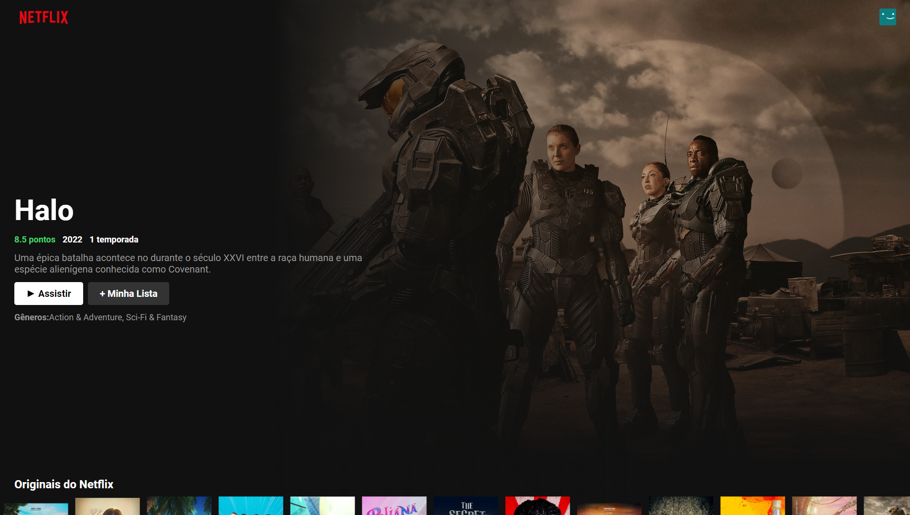
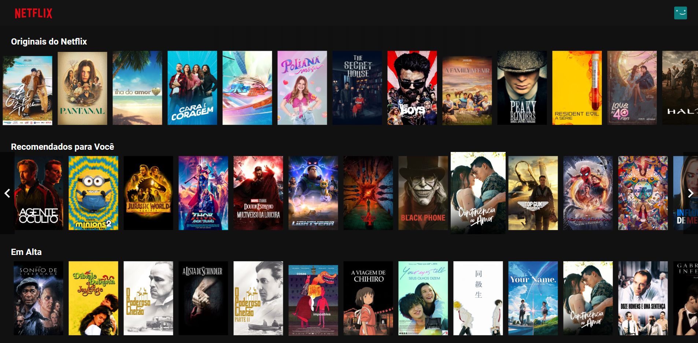
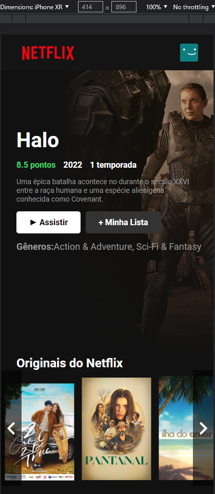

<h1 align="center"><a href="https://netflix-clone-5af4a.web.app" target="_blank" rel="noopener noreferrer">Clone Netflix</a></h1>

     

  

    

   

      

<h2>Projeto</h2>

Este é um projeto com intuito de tentar clonar a pagina inicial do site Netflix, utilizando uma api para mostrar o catalogo de filmes e series de forma
interativa e com responsividade.

   

<h2>Tecnologias</h2>
<ul>
   <li>React</li>
   <li>Firebase</li>
   <li>JavaScript</li>
   <li>CSS</li>
</ul>
